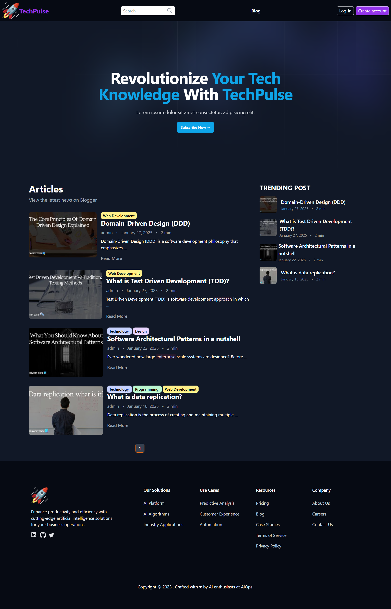
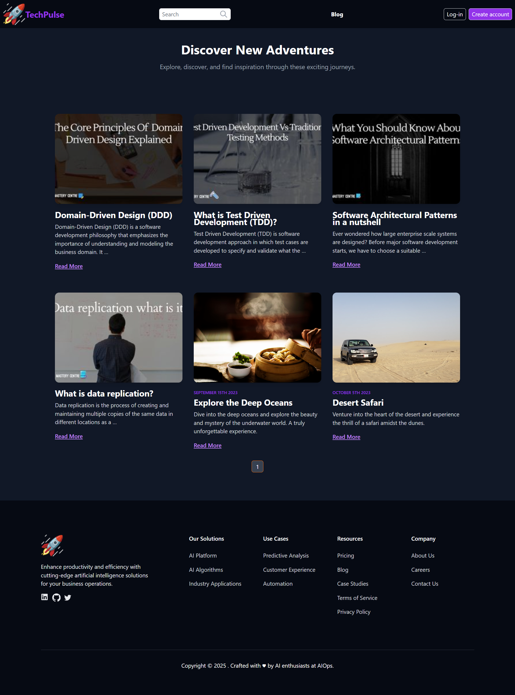
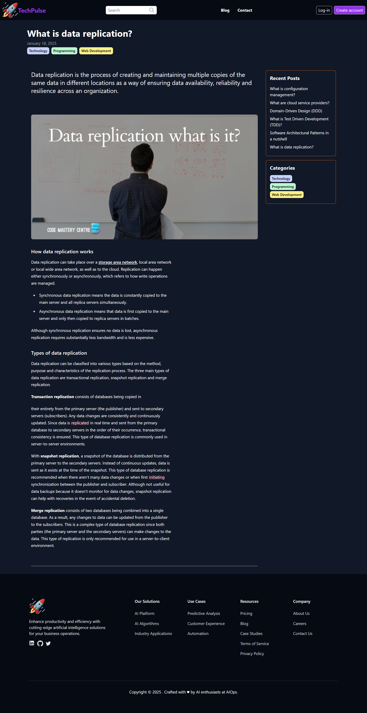

# TechPulse ✍️

## Overview

TechPulse is a modern personal blog platform designed to share insights, tutorials, and news about Technology, Programming, Web Development, Design, and AI/Machine Learning. Built with Django and Wagtail, TechPulse provides a seamless and user-friendly content management experience, allowing you to publish and manage your articles efficiently.


## Site Screenshots:

| **Homepage**  | **Blog**  | **Page-Detales**  |
|:---:|:---:|:---:|
| |  |  |


## Getting Started

To get started with Plan Pilot, follow these steps:

#### Prerequisites

Ensure that you have the following prerequisites installed on your system:

- Python (version 3.6 or higher)
- Wagtail(wagtail-CMS version 6.3 or higher)
- Pip (Python package installer)
- Virtualenv (optional but recommended for virtual environment setup)

#### Installation

1. Clone the repository to your local machine:
```
git clone https://github.com/mahmoudessam820/techpulse.git
```

2. Navigate to the project directory:
```
cd techpulse
```

3. Create a virtual environment (optional but recommended):
```
virtualenv venv
```

4. Activate the virtual environment:
- On Windows:
    ```
    env\Scripts\activate.bat
    ```
- On macOS/Linux:
    ```
    source venv/bin/activate
    ```

5. Install the project dependencies:
```
pip install -r requirements.txt
```

## Technologies Used

**TechPulse** leverages the following technologies and frameworks:

1. **Django** A high-level Python web framework that encourages rapid development and clean, pragmatic design. It provides built-in features for tasks such as database migrations, URL routing, and template rendering.

2. **Wagtail (CMS)** Wagtail is a free and open-source content management system (CMS) written in Python. It is popular amongst websites using the Django web framework. The project is maintained by a team of open-source contributors backed by companies around the world.  The project has a focus on developer friendliness  as well as ease of use of its administration interface, translated in multiple languages.

2. **Tailwind CSS** A highly customizable, utility-first CSS framework that enables the creation of modern and responsive user interfaces. TechPulse utilizes Tailwind CSS for styling, ensuring a sleek and intuitive user experience.

3. **Other Dependencies:**  Additional dependencies and libraries are listed in the `requirements.txt` file. These include tools and packages that enhance the functionality and performance of the project.


## Author

- [@mahmoudessam820](https://github.com/mahmoudessam820)

## 🔗 Links

[](https://www.linkedin.com/in/mahmoud-el-kariouny-822719149/)
[](https://twitter.com/Mahmoud42275)


## Feedback

If you have any feedback, please reach out to us at esame4166@gmail.com


## Contributing

Contributions are welcome! 

Feel free to submit bug reports, feature requests, or pull requests to improve the this project.